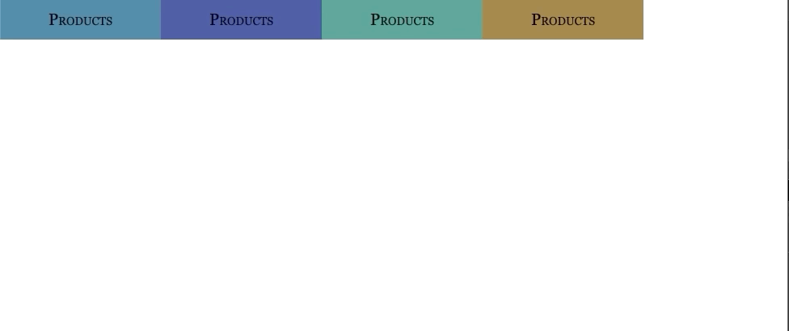

# Izidropdown.

> This is  project based on a basic module to easly implement drop-down menus.

## Usage

- Coming soon. :construction_worker:

## Built With

- Webpack
- ES6
- SASS

## Live Demo

[Live Demo Link :rocket:](#) 
- Coming soon. :construction_worker:

## Authors

👤 **David Elí**

- Github: [@davitomix](https://github.com/davitomix)
- Twitter: [@davitomix007](https://twitter.com/davitomix007)
- Linkedin: [David Garcia](https://www.linkedin.com/in/davideligarcia/)

## 🤝 Contributing

Contributions, issues and feature requests are welcome!

Feel free to check the [issues page](issues/).

## Show your support

Give a ⭐️ if you like this project!

## 📝 License

ISC.
